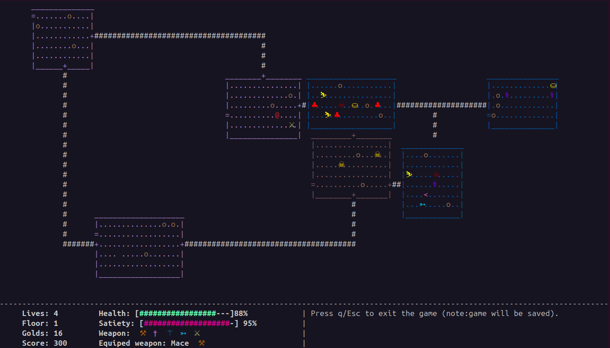
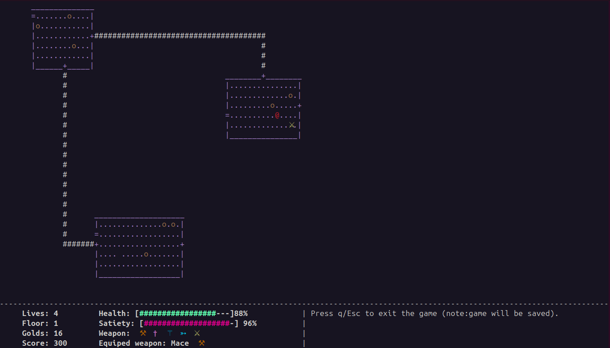
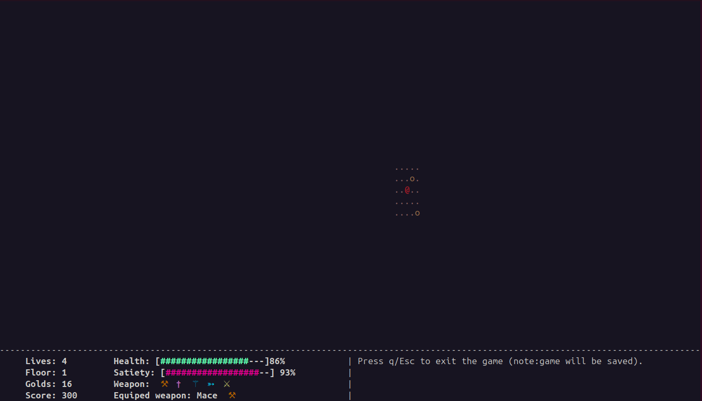
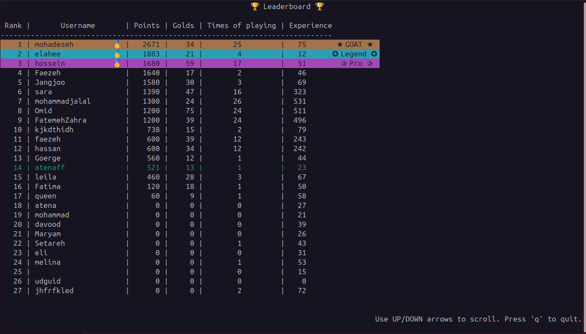

# Terminal Rogue

A terminal-based roguelike game written in **C** using **ncursesw**.

The game features procedurally generated dungeon maps, exploration, combat, collectible items, multiple room types, user profiles, save/load functionality, and a persistent leaderboard.

Originally developed as an individual project for the **Fundamentals of Programming** course at Sharif University of Technology.

<p align="center">
  
</p>

## Features

- Procedurally generated dungeon maps with interconnected rooms and corridors
- Exploration system with hidden and previously discovered areas
- Multiple room themes with different gameplay mechanics
- Limited-visibility **Nightmare Rooms**
- Multiple enemy types and combat mechanics
- Melee and ranged weapons
- Collectible gold, food, weapons, and magical items
- Health and satiety systems
- Multiple dungeon floors
- Save and continue functionality
- User accounts and profiles
- Persistent leaderboard and player statistics
- Colored terminal interface with Unicode symbols
- Full-map reveal mode

## Gameplay

During normal exploration, only discovered areas of the dungeon remain visible.

<table>
<tr>
<td align="center"><b>Exploration Mode</b></td>
<td align="center"><b>Nightmare Room</b></td>
</tr>
<tr>
<td></td>
<td></td>
</tr>
</table>

The game also includes a full-map reveal mode that displays the complete generated dungeon.

## Leaderboard

Player statistics such as score, collected gold, number of games played, and experience are stored and displayed in a persistent leaderboard.

<p align="center">
  
</p>

## Built With

- **C**
- **ncursesw**
- **GCC**
- **GNU Make**

## Build and Run

### Requirements

You need:

- GCC
- GNU Make
- ncurses development libraries

On Ubuntu/Debian:

```bash
sudo apt install build-essential libncurses-dev
```
#Build

Clone the repository and run:
```
make
```
Then start the game with:

```./terminal-rogue```

To remove generated build files:

```make clean```

#Controls

The game is controlled entirely from the keyboard.
Some important controls include:

- M — reveal/hide the full dungeon map
- q / Esc — save and exit the current game

Additional controls and actions are shown through the in-game menus.

#Project Structure
.
├── auth.c / auth.h          # User authentication and profiles
├── create_map.c / .h       # Dungeon and room generation
├── game.c / game.h         # Core gameplay logic
├── menu.c / menu.h         # Terminal menus
├── save_load.c             # Save/load system
├── scoreboard.c            # Leaderboard and player statistics
├── startup.c / startup.h   # Game initialization
├── main.c                   # Program entry point
└── Makefile                 # Build configuration

#Notes

Runtime-generated user data and saved games are intentionally excluded from version control.
The game is currently built and tested on Linux terminals with Unicode support.

#License

This project is available under the license included in the repository.
